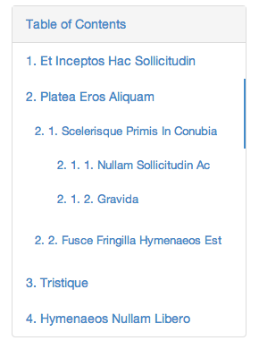

# TocJS

TocJS is a jQuery plugin for generating table of contents based on headings.



## Demo

* [Sample demo](https://rawgithub.com/nghuuphuoc/tocjs/master/demo/sample.html)
* [Style with Bootstrap](https://rawgithub.com/nghuuphuoc/tocjs/master/demo/style.html)
* [Scroll automatically](https://rawgithub.com/nghuuphuoc/tocjs/master/demo/scroll.html)
* [Number indexing](https://rawgithub.com/nghuuphuoc/tocjs/master/demo/number-indexing.html)
* [More indexing styles](https://rawgithub.com/nghuuphuoc/tocjs/master/demo/more-indexing.html)

## Features

* Allow to define different format for each heading level
* Generate anchor link for heading
* Automatically scroll to with the help of [Bootstrap ScrollSpy](http://getbootstrap.com/javascript/#scrollspy) plugin
* The table of contents are generated using nested ```ul``` elements
* Easy to customize look and feel

## Download

You can download TocJS from the [Github repository](https://github.com/nghuuphuoc/tocjs) directly or use [bower](http://bower.io):

```bash
$ bower install tocjs
```

## Usage

By default, TocJS generates a table of contents based on the headings (```h1``` to ```h6```) found on page.

In order to use this plugin:

* Insert ```toc.js``` to your page, ensure that it is placed after jQuery:

```html
<script type="text/javascript" src="path/to/jquery-1.10.2.min.js"></script>
<script type="text/javascript" src="path/to/toc.js"></script>
```

* Call the plugin when the document is ready:

```javascript
<script type="text/javascript">
$(document).ready(function() {
    $('element selector').toc();
});
</script>
```

The plugin provides the following options:

* ```selector``` (default value is _h1, h2, h3, h4, h5, h6_): Indicates which elements will be found and included in the table of contents
* ```elementClass``` (_toc_): The CSS class which will be added to root element
* ```rootUlClass``` (_toc-ul-root_): The CSS class which will be added to the root generated ```ul``` element
* ```ulClass``` (_toc-ul_): The CSS class which will be added to all generated ```ul``` elements (including the root and sub ones)
* ```prefixLinkClass``` (_toc-link-_): This option will be added as a prefix to CSS class of all generated ```a``` elements. The suffix is level of associating heading (1 to 6)
* ```heading``` (_null_): The _Table of Contents_ heading label placed at the top. This heading is not shown by default.
* ```indexingFormats``` (_{}_): Define the indexing formats for each heading level

```javascript
$(element).toc({
    indexingFormats: {
        <headingLevel>: '<formatter>'
    }
});
```

```<headingLevel>``` can be 'h1', 'h2', ..., 'h6'

```<formatter>``` is a string and can be:

Value                        | Description
-----------------------------|------------
```number``` or ```1```      | The headings will be prefixed with number (1, 2, 3, ...)
```upperAlphabet```, ```A``` | Prefix headings with uppercase alphabetical characters (A, B, C, ...)
```lowerAlphabet```, ```a``` | Prefix headings with lowercase alphabetical characters (a, b, c, ...)
```upperRoman```, ```I```    | Prefix headings with uppercase Roman numerals (I, II, III, ...)
```lowerRoman```, ```i```    | Prefix headings with lowercase Roman numerals (i, ii, iii, ...)

You can define different formatter for each heading level, for example:

```javascript
$(element).toc({
    indexingFormats: {
        'h1': 'upperAlphabet',
        'h2': 'number',
        'h3': 'lowerAlphabet'
    }
});

$(element).toc({
    indexingFormats: {
        'h1': 'A',
        'h2': '1',
        'h3': 'a'
    }
});

$(element).toc({
    indexingFormats: 'A1a'
});
```

If you want to set indexing formats for all levels:

```javascript
$(element).toc({
    // <formatter> can be 'number', 'upperAlphabet', 'lowerAlphabet', 'upperRoman', 'lowerRoman'
    indexingFormats: '<formatter>'
});
```

## Customize the look and feel

Assume that ```<div id="toc"></div>``` is the element containing the table of contents.
By default, TocJS generates the following markup:

```html
<div id="toc" class="toc">
    <ul class="toc-ul-root toc-ul">
        <li class="toc-heading"><a href="#">Table of Contents</a></li>

        <li><a href="#" class="toc-link-1">h1 heading</a></li>
        <li>
            <a href="#" class="toc-link-1">h1 heading</a>
            <ul class="toc-ul">
                <li><a href="#" class="toc-link-2">h2 heading</a></li>
                ...
            </ul>
        </li>
    </ul>
</div>
```

To customize the styles of table of contents, you can customize the ```toc```, ```toc-ul-root```, ```toc-ul```, ```toc-heading```, and ```toc-link-[1..6]``` classes.
Or create your own CSS classes and set them using the TocJS options which are described in the above section.

## Build

TocJS uses [grunt](http://gruntjs.com) for building process.
The process includes the following steps:

* Copy entire ```src/css``` and ```src/js``` directories to ```dist``` directory
* Compress the CSS files in ```src/css``` and save to ```dist/css```
* Compress the ```src/js/toc.js``` and save to ```dist/js/toc.min.js```

Grunt helps us simplify the process.

First, you have to install the dependencies defined in ```package.json``` (the following commands might need the administrator permission to run):

```
$ cd <TocJs_Directory>
$ npm install grunt --save-dev
$ npm install grunt-contrib-copy --save-dev
$ npm install grunt-contrib-cssmin --save-dev
$ npm install grunt-contrib-uglify --save-dev
```

Then, run the command below from the TocJS directory:

```
$ grunt
```

## Author

Nguyen Huu Phuoc, aka @nghuuphuoc

* [http://github.com/nghuuphuoc](http://github.com/nghuuphuoc)
* [http://twitter.com/nghuuphuoc](http://twitter.com/nghuuphuoc)

## License

```
The MIT License (MIT)

Copyright (c) 2013 - 2014 Nguyen Huu Phuoc

Permission is hereby granted, free of charge, to any person obtaining a copy of
this software and associated documentation files (the "Software"), to deal in
the Software without restriction, including without limitation the rights to
use, copy, modify, merge, publish, distribute, sublicense, and/or sell copies of
the Software, and to permit persons to whom the Software is furnished to do so,
subject to the following conditions:

The above copyright notice and this permission notice shall be included in all
copies or substantial portions of the Software.

THE SOFTWARE IS PROVIDED "AS IS", WITHOUT WARRANTY OF ANY KIND, EXPRESS OR
IMPLIED, INCLUDING BUT NOT LIMITED TO THE WARRANTIES OF MERCHANTABILITY, FITNESS
FOR A PARTICULAR PURPOSE AND NONINFRINGEMENT. IN NO EVENT SHALL THE AUTHORS OR
COPYRIGHT HOLDERS BE LIABLE FOR ANY CLAIM, DAMAGES OR OTHER LIABILITY, WHETHER
IN AN ACTION OF CONTRACT, TORT OR OTHERWISE, ARISING FROM, OUT OF OR IN
CONNECTION WITH THE SOFTWARE OR THE USE OR OTHER DEALINGS IN THE SOFTWARE.
```